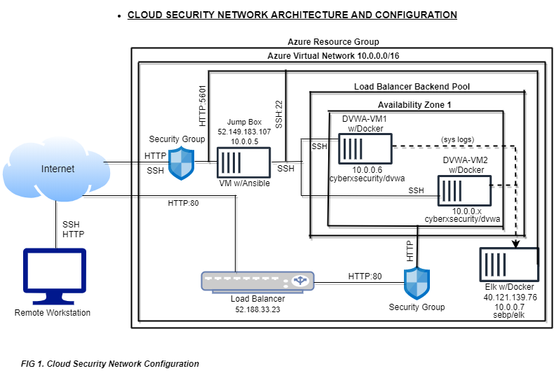
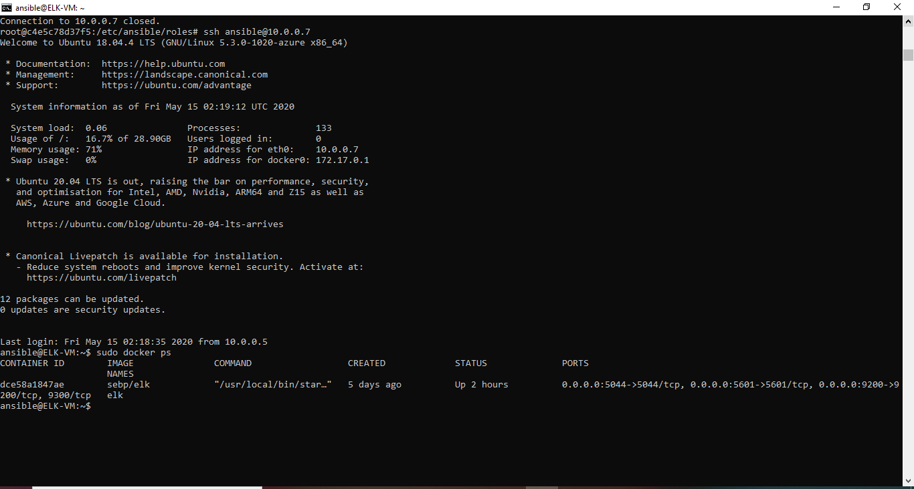

### CLOUD SECURITY ARCHITECTURE AND CONFIGURATION
---
### Automated ELK Stack Deployment
***
The files in this repository were used to configure the network depicted below.

These files have been tested and used to generate a live **`ELK`** deployment on Azure. They can be also be used to recreate the entire deployment pictured above. Alternatively, select portions of the **`Install-elk.yml`** file may be used to install only certain pieces of it, such as Filebeat.

This document contains the following details:
- Description of the Topology
- Access Policies
- ELK Configuration
- Beats in Use
- Machines Being Monitored
- How to Use the Ansible Build

### Description of the Topology
The main purpose of this network is to expose a load-balanced and monitored instance of DVWA, the D*mn Vulnerable Web Application.
Load balancing ensures that applications will be highly **`available,`** in addition to restricting **`access`** to the network.
Integrating an ELK server allows users to easily monitor the vulnerable VMs for changes to the **`syslog`** and system **`metrics`**.

The configuration details of each machine may be found below.

| **`Name`**         | **`Function`**    | **`IP address`** | **`Operating System`**|
|:---------------:|:---------------:|:--------------:|:------------------:|
| **`Jump Box`**    | `Gateway`       | `10.0.0.5`     | `Linux`            |
| **`DVWA-VM1`**    | `Server`        | `10.0.0.6`     | `Linux`            |
| **`DVWA-VM2`**    | `Server`        | `10.0.0.x`     | `Linux`            |
| **`ELK-VM`**      | `Server`        | `10.0.0.7`     | `Linux`            |
| **`LOAD BALANCER`** | `Load Balancer` | `52.188.33.23` | `LB`               |

### Access Policies
The machines on the internal network are not exposed to the public Internet. 
Only the **`Load Balancer, ELK-VM and Jump Box`** machines can accept connections from the Internet. Access to this machine is only allowed from the following IP addresses:
* `52.188.33.23 Load Balancer`
* `40.121.139.76 ELK VM`
* `52.149.183.107 Jump Box`

Machines within the network can only be accessed by the **`Jump Box IP 10.0.0.5`**.

A summary of the access policies in place can be found in the table below.

| **`Name`**          | **`Publicly Accessible`** | **`Allowed IP Addresses`** |
|:---------------:|:---------------------:|:----------------------:|
| **`Jump Box`**      | `Yes`                 | `216.164.236.207`      |
| **`DVWA-VM1`**      | `No`                  | `10.0.0.5`             |
| **`DVWA-VM2`**      | `No`                  | `10.0.0.5`             |
| **`ELK-VM`**        | `Yes`                 | `216.164.236.207`      |
| **`LOAD BALANCER`** | `yes`                 | `0.0.0.0`      |

### Elk Configuration
Ansible was used to automate configuration of the ELK machine. No configuration was performed manually, which is advantageous because `automatic configuration drastically reduces the potential for human error` & `multiple VM’s can be configured identically all at once`.

The playbook implements the following tasks:

* `Name: docker.io`: the docker engine, used for running containers. 
* `Name: python-pip`: the package used to install Python software. 
* `Name: docker`: Install docker python module: 
* `Command: sysctl -w vm.max_map_count=262144`: configures the ELK VM to use more memory.
* `Image: sebp/elk`: downloads and launch a docker container on ELK VM.
* `Published_ports`: 5601:5601 9200:9200 5044:5044: publishes ports on ELK VM.

The following screenshot displays the result of running docker ps after successfully configuring the ELK instance.

### Target Machines & Beats 
This ELK server is configured to monitor the following machines:

* `DVWA-VM1: 10.0.0.6` 
* `DVWA-VM2: 10.0.0.x`

We have installed the following Beats on these machines:
* **Filebeat and Metricbeat**

These Beats allow us to collect the following information from each machine:
* **`Filebeat`** monitors the `log files` or `locations` specified, collects log events, and forwards them either to Elasticsearh or Logstash for indexing. `E.g. System log`
* **`Metricbeat`** is a lightweight shipper that can be installed on servers to periodically `collect metrics` from the `operating system` and from `services` running on the server. `E.g. Apache, MySQL, Redis, CPU, RAM, MEMORY`.

### Using the Playbook
In order to use the playbook, you will need to have an Ansible control node already configured. Assuming you have such a control node provisioned: 
SSH into the control node and follow the steps below:
* Copy the `/etc/ansible/files/filebeat-configuration` file to `ELK VM`.
* Update the `/etc/ansible/hosts` file to include `[webservers] 10.0.0.6 10.0.0.x` and `[elkserver] 10.0.0.7`
* Run the playbook and navigate to `http://[ELK-VM.IP]:5601` to check that the installation worked as expected.

As a **Bonus**, provide the specific commands the user will need to run to download the playbook, update the files, etc.

* `Command: curl -L -O https://artifacts.elastic.co/downloads/beats/filebeat/filebeat-7.6.1-amd64.deb`: downloads the .deb file from [artifacts.elastic.co]
* `Command: dpkg -i filebeat-7.6.1-amd64.deb`: installs the .deb file. 
* `Copy`:

         `src: /etc/ansible/files/filebeat-configuration.yml`
    
         `dest: /etc/filebeat/filebeat.yml`: copies the filbeat-configuration file from ansible container to ELK-VM.
* `Command: filebeat modules enable system`: starts processing common log formats. 
* `Command: filebeat setup`: creates index pattern and loads the dashboards into Kibana.
* `Command: service filebeat start`: makes filebeat ready to send files to defined output.
